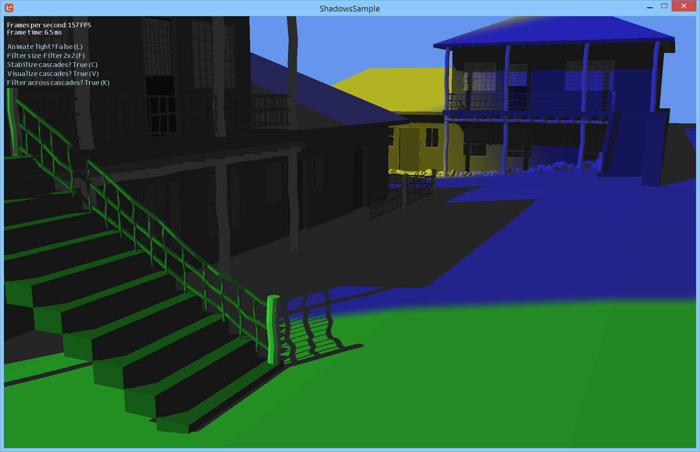

# Cascaded Shadow Maps

This is a MonoGame port of Matt Pattineo's Shadows Sample:  
https://mynameismjp.wordpress.com/2013/09/10/shadow-maps/

MJP's shadows sample was released under the Microsoft Public License (Ms-PL).

Only a limited subset of options from MJP's shadows sample have been ported.
Specifically, for shadow filtering, only the Optimized PCF option has been implemented.

--------------

The 3D buildings model used in this sample was downloaded from:  
http://www.turbosquid.com/3d-models/free-3ds-model-neighborhood-village/784906

--------------

**Note**: This sample uses features that were added to MonoGame after the v3.3 release.
So you need to either [download a development build](http://www.monogame.net/downloads/),
or wait for v3.4.